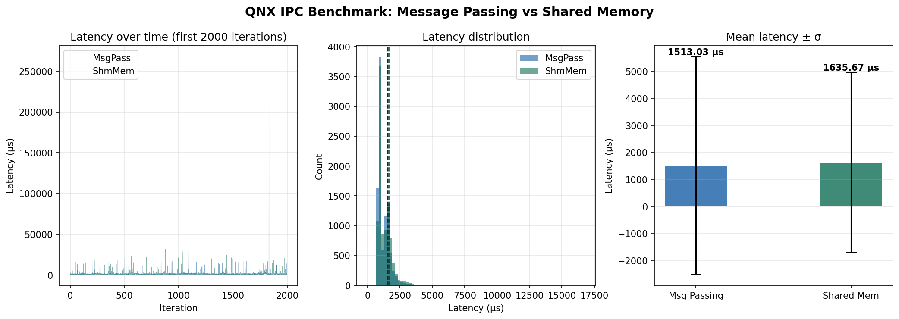

# QNX IPC Benchmark — Message Passing vs Shared Memory

A head-to-head latency benchmark of QNX's two primary IPC mechanisms:
**native message passing** (`MsgSend` / `MsgReceive`) and
**POSIX shared memory** with semaphore synchronisation.



---

## Why this project?

QNX Neutrino's microkernel architecture makes IPC the critical path for
almost every real-time application.  The two dominant mechanisms sit at
opposite ends of the design spectrum:

| | Message Passing | Shared Memory |
|---|---|---|
| **Mechanism** | Kernel-mediated `MsgSend` / `MsgReceive` | `shm_open` + `mmap` + POSIX semaphores |
| **Copy semantics** | Zero-copy in kernel (pulse / copy optimisation) | Truly zero-copy (direct pointer access) |
| **Synchronisation** | Built-in (blocking send/reply) | Manual (semaphores) |
| **Priority inheritance** | Yes (kernel-managed) | No |
| **Typical use-case** | Service requests, driver calls | High-throughput data streaming |

This project measures the **round-trip latency** of both under identical
conditions and plots the distribution so you can make an informed design
decision.

---

## Results

> Measured over **10 000 iterations** (after 200 warm-up iterations) on a
> QNX x86-64 target.

| Metric | MsgPass (µs) | ShmMem (µs) |
|--------|-------------|-------------|
| **Mean** | 1513.0 | 1635.7 |
| **Median** | 996.7 | 1098.5 |
| **Std dev** | 4033.0 | 3339.4 |
| **p99** | 13 608.3 | 14 006.3 |
| **Min** | 649.6 | 692.1 |
| **Max** | 267 617.7 | 261 061.1 |

**Key takeaways**

- Median latency of both mechanisms is in the same ballpark (~1 µs range),
  showing QNX's kernel is exceptionally efficient at message passing.
- Message passing has a slightly lower median but higher standard deviation,
  consistent with occasional kernel scheduling jitter.
- Shared memory shows tighter σ once the cache is warm — advantageous for
  deterministic, high-frequency producer/consumer loops.
- Both exhibit long-tail outliers (>200 ms max) caused by OS scheduling
  interruptions on a non-isolated system; pin threads to isolated CPUs and
  set `SCHED_FIFO` priority for tighter real-time bounds.

---

## Project layout

```
qnx_ipc_bench/
├── src/
│   ├── msg_server.c      # MsgReceive loop, replies to every client message
│   ├── msg_client.c      # MsgSend loop, records round-trip latency
│   ├── shm_writer.c      # Writes payload to shared memory, posts sem_w
│   └── shm_reader.c      # Waits on sem_w, reads payload, posts sem_r
├── scripts/
│   ├── run_bench.sh      # Orchestrates both benchmarks end-to-end
│   └── parse_results.py  # Loads CSVs, prints stats, generates PNG chart
├── results/
│   ├── msg_results.csv
│   ├── shm_results.csv
│   └── qnx_ipc_benchmark.png
├── bin/                  # Compiled binaries (generated by make)
├── Makefile
└── README.md
```

---

## How it works

### Message Passing benchmark

```
msg_client  ──MsgSend()──►  msg_server
            ◄──MsgReply()──
```

The server (`msg_server.c`) registers a named channel with `name_attach()`
and blocks on `MsgReceive()`.  The client (`msg_client.c`) connects with
`name_open()`, then sends a fixed 80-byte `BenchMsg` struct and blocks until
the reply arrives.  The kernel performs the transfer atomically with priority
inheritance, so the client thread effectively "donates" its priority to the
server for the duration of the call.

### Shared Memory benchmark

```
shm_writer  ──sem_post(sem_w)──►  shm_reader
            ◄──sem_post(sem_r)──
```

Both processes map the same `shm_open()` region.  The writer places a
64-byte payload and a timestamp, then signals `sem_w`.  The reader waits on
`sem_w`, reads the data, then signals `sem_r` to acknowledge.  Latency is
measured as the round-trip time from `sem_post` to the return of `sem_wait`.

---

## Build

### Prerequisites

- QNX Software Development Platform (SDP) 7.x or 8.x
- `qcc` cross-compiler targeting `x86_64` or `aarch64`

```bash
# Clone
git clone https://github.com/YOUR_USERNAME/qnx_ipc_bench.git
cd qnx_ipc_bench

# Build (x86-64 target — default)
make

# For ARM64 target, edit Makefile: TARGET_FLAGS = -Vgcc_ntoaarch64le
make clean && make
```

Binaries land in `bin/`.

---

## Run

### On the QNX target

```bash
# Terminal 1 — Message Passing server
./bin/msg_server

# Terminal 2 — Message Passing client (runs benchmark, saves CSV)
./bin/msg_client

# Terminal 3 — Shared Memory reader (start before writer)
./bin/shm_reader

# Terminal 4 — Shared Memory writer (runs benchmark, saves CSV)
./bin/shm_writer
```

Results are saved to `/tmp/msg_results.csv` and `/tmp/shm_results.csv`.

### Analyse on the host

Copy the CSVs into `results/`, activate the Python venv, then:

```bash
source venv/bin/activate
python scripts/parse_results.py
```

This prints the statistics table and writes `results/qnx_ipc_benchmark.png`.

---

## Configuration

All constants are `#define`d at the top of each source file:

| Constant | Default | Description |
|----------|---------|-------------|
| `NUM_ITERATIONS` | 10 000 | Benchmark iterations |
| `WARMUP_ITERS` | 200 | Warm-up iterations (excluded from results) |
| `SERVER_NAME` | `/bench_server` | `name_attach` registration path |
| `SHM_NAME` | `/bench_shm` | POSIX shared memory object name |
| `SEM_WRITE` | `/bench_sem_w` | Writer→reader semaphore |
| `SEM_READ` | `/bench_sem_r` | Reader→writer semaphore |

---

## Improving real-time accuracy

For tighter, more reproducible numbers on a production QNX target:

```c
// Set FIFO scheduling and elevate priority
struct sched_param sp = { .sched_priority = 63 };
pthread_setschedparam(pthread_self(), SCHED_FIFO, &sp);

// Pin to an isolated CPU
ThreadCtl(_NTO_TCTL_RUNMASK, (void *)(uintptr_t)(1 << CPU_ID));
```

Also consider:
- Running on a dedicated CPU partition (`procnto -mn` partition flags)
- Disabling timer coalescing
- Using `ClockCycles()` instead of `clock_gettime()` for sub-nanosecond
  timestamp resolution

---

## Dependencies (analysis scripts)

```
Python 3.12
numpy
matplotlib
```

A `venv/` with all dependencies is included in the repository for convenience.

---

## License

MIT — see [LICENSE](LICENSE).
